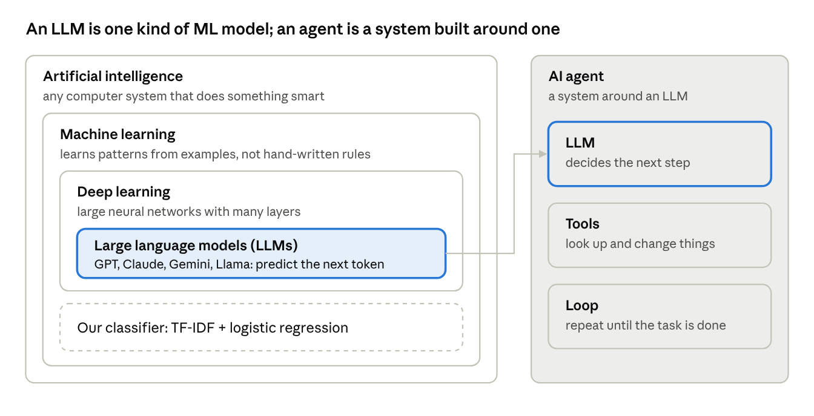
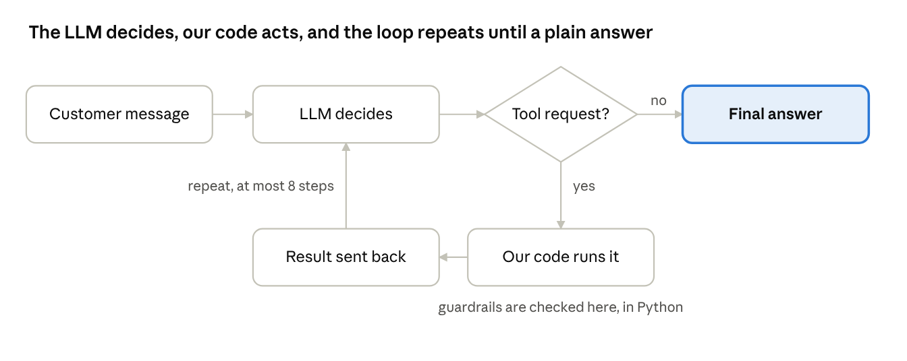
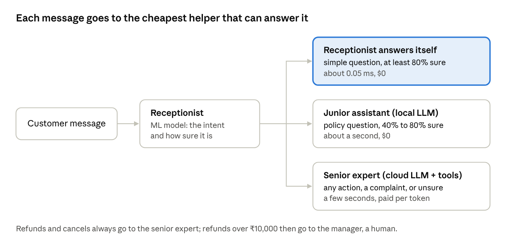

# Agent on a Budget: The Theory Guide

*Workshop: Build Your First AI Agent: From Machine Learning & LLMs to Real-World Workflows.*
The live, editable version of this guide is a Claude doc; this file is a copy kept with the code.

## How to use this guide

This guide explains every idea behind the **agent-on-a-budget** repo in plain English, and ties each one to the workshop's three chapters.

Read it top to bottom once. Then keep the Glossary open while you go through the code and notebooks. Each part ends with the repo files where the idea lives.

### What you need before you start

You do not need a maths degree or ML experience. You do need these basics:

| Prerequisite | Level needed | Why it matters here |
| --- | --- | --- |
| Python | Comfortable: functions, lists, dictionaries, classes. No need to install Python: uv does it | All the code is Python |
| pandas | Basic: load a CSV, filter rows, count values | Every notebook uses DataFrames |
| Jupyter notebooks | Can run cells in order | The step-by-step version of the project |
| Command line | `cd`, run a command (the [install guide](install-guide.md) shows every step) | `uv run python run.py ...` and `uv run streamlit run app.py` |
| Git and GitHub | Clone, commit, push | Sharing the repo with attendees |
| JSON and APIs | Know what a JSON object and an API key are | LLMs are called over an API and reply in JSON |
| Basic maths | Percentages, averages, what a probability between 0 and 1 means | Accuracy and confidence |

If any row feels shaky, start with the matching resources in **Where to read** at the end of this guide.

## The story in one page

The workshop follows its title, **Build Your First AI Agent: From Machine Learning & LLMs to Real-World Workflows**, one chapter per part. The README, notebooks, demo app and diagram all use these same names and examples.

| Title | Chapter | The one idea | Theory in this guide |
| --- | --- | --- | --- |
| Build Your First AI Agent | 1. Give an LLM hands | An agent = an LLM + tools + a loop | Parts 3 and 4 |
| From Machine Learning & LLMs | 2. The LLM teaches a small ML model | The big model teaches, the small model does the easy work | Parts 2 and 5 |
| To Real-World Workflows | 3. The whole support office | Each message goes to the cheapest helper that can answer it | Part 6 |

Think of a customer support office. You would not send every question to your most expensive expert, so neither should your AI:

| Helper | What it is | Example message |
| --- | --- | --- |
| Receptionist | The small ML model; answers when at least 80% sure | "track my order NM10009": running shoes, shipped, arriving 8 Oct |
| Junior assistant | A small LLM on the laptop (Ollama); policy questions, 40% to 80% sure | "kitne din me delivery hoti hai" |
| Senior expert | The cloud LLM agent with tools; refunds, cancels, complaints, anything unclear | "my order NM10002 arrived broken, I want a refund": ₹5,999 refund started |
| Manager | A human; refunds above ₹10,000 and very upset customers | "refund NM10018, I don't like the chair": ₹12,999, so a human approves |

The code calls the same steps "versions": version 1 is the LLM alone, version 2 is the senior expert, version 3 trains the receptionist, version 4 is the whole office.

The full architecture diagram is in [`architecture/agent-on-a-budget.html`](architecture/agent-on-a-budget.html).

## Part 1: The big picture

AI, machine learning, deep learning and LLMs are circles inside each other. An agent is not another circle: it is a system built around a model.



Our intent classifier sits in machine learning but not in deep learning: it is a classic, small model. The agent uses an LLM as its brain.

- **Artificial Intelligence (AI):** any computer system that does something we would call "smart". The broadest term.
- **Machine Learning (ML):** a part of AI where the computer **learns patterns from examples** instead of following rules a person wrote. Our intent classifier is ML.
- **Deep Learning:** ML with large neural networks, many layers of simple maths units. Good at text, images and speech.
- **Large Language Models (LLMs):** very large deep learning models trained on huge amounts of text to predict the next word. GPT, Claude, Gemini and Llama are LLMs.
- **AI agent:** a program where an LLM **decides what to do next** and can **take actions** through tools, in a loop, until a task is done.

One idea connects the whole workshop: **an LLM is also an ML model, just a very big one.** Small ML models are fast, cheap and narrow. LLMs are slow, expensive and general. Good systems use both.

## Part 2: Machine learning basics

Our ML model reads a customer message and guesses its **intent** (what the customer wants) out of 27 options. It gets 98.3% right on clean messages, in about 0.05 milliseconds, for free.

### Supervised learning

We show the model many **examples with answers** ("where is my package" → `track_order`). It finds patterns that link the words to the answers. Then it predicts answers for messages it has never seen. Learning from labelled examples is called **supervised learning**. Picking one answer from a fixed list is called **classification**.

### Features: turning text into numbers

Models only understand numbers, so every message must become a list of numbers first. These numbers are called **features**.

- **Bag of words** counts how often each word appears. Simple, but "ordr" and "order" look like two different words.
- **TF-IDF** (term frequency × inverse document frequency) gives more weight to words that are rare across all messages, like "refund", and less to common words, like "the".
- **Character n-grams** split words into small chunks: "order" becomes "or", "ord", "rde", "der". A typo like "ordr" still shares most chunks with "order". This is why our model handles typos better. In the repo it is `TfidfVectorizer(analyzer="char_wb", ngram_range=(2, 5))`.

### The model: logistic regression

Despite its name, logistic regression is a **classifier**. It learns a weight for each feature and each intent. For a new message it adds up the weights and turns the totals into **probabilities** that sum to 1, one per intent.

The setting `C` controls how much the model holds back. A small `C` gives careful, flat probabilities. A larger `C` (we use 20) gives sharper, more confident ones. In notebook 03, raising `C` lifted average confidence from 47% to 88%.

### Train and test split

We never test a model on the examples it learned from: that is like marking a student on questions they memorised. We keep 1,080 messages for **training** and 540 unseen ones for **testing**, plus 50 messy messages as a harder test.

### Measuring it

- **Accuracy** = correct predictions ÷ all predictions. Ours: 98.3% on clean test messages, 60% on messy ones.
- **Confusion matrix** = a table of which intents get mixed up with which. It shows *where* the model fails.
- **Precision and recall** = for one intent, how many of its predictions were right, and how many of the real cases it found.

### Confidence: the key idea for the router

The highest probability is the model's **confidence**. Wrong answers usually come with low confidence. On our mixed inbox, when the model is at least 80% sure, it answers 79% of messages and gets all of those right. So we trust it only above that line.

### Overfitting

A model **overfits** when it memorises the training examples instead of learning general patterns. It then looks great on training data and poor on new data. The test set catches this. `min_df=2` (ignore chunks seen only once) is a small guard against it.

**In the repo:** `budget_agent/classifier.py`, `notebooks/03_llm_labels_ml_learns.ipynb`.

## Part 3: How LLMs work

An LLM is a huge neural network trained to do one thing: **predict the next token**. Everything else (answering, reasoning, calling tools) comes from doing that very well, one token at a time.

### Tokens

LLMs read and write **tokens**, not words. A token is a piece of a word, about 4 characters of English on average. "Refund my order" is roughly 4 tokens. You pay per token, and speed is measured in tokens per second.

### Training, in two stages

1. **Pre-training:** the model reads a huge amount of text and learns to predict the next token. This teaches it language and general knowledge.
2. **Fine-tuning:** it is then trained on examples of good answers and human feedback, so it follows instructions and behaves helpfully.

The model's knowledge stops at its training date, which is why our agent needs tools to see live data like orders.

### Prompts

- **System prompt:** standing instructions for the whole conversation, such as "You are NovaMart's support assistant. Be short. Never make up order details." See `SYSTEM_PROMPT` in `budget_agent/agent.py`.
- **User message:** what the customer writes.
- **Context window:** everything the model can see at once: system prompt, conversation and tool results. Anything outside it, the model does not know.

LLMs are **stateless**: they remember nothing between calls. To continue a conversation, we send the whole history again every time.

### Cost and speed

You pay for **input tokens** (what you send) and **output tokens** (what it writes). Output usually costs about 5 times more. For example, `gpt-6.1-sol` costs $2 per million input tokens and $10 per million output tokens:

```
cost = (input tokens × input price + output tokens × output price) / 1,000,000
```

This is `cost_usd()` in `budget_agent/llm.py`. One call costs a fraction of a cent, but an agent makes 2 to 3 calls per message, and a shop gets thousands of messages a day.

### Structured outputs

You can force an LLM to reply in an exact JSON shape (a **JSON schema**). Our labeller asks for `{"labels": [{"id": 1, "intent": "track_order"}, ...]}`, and the intent must be one of the 27 allowed values. This makes the reply safe to read in Python.

### Reasoning and effort

Newer models can **think** before answering. More thinking gives better answers on hard tasks but costs more tokens and time. Many APIs let you set the **effort** level. We ask for low effort when labelling, because it is an easy task.

### Providers

OpenAI (GPT), Anthropic (Claude) and Google (Gemini) all work the same way: send messages, get a reply, pay per token. Ollama runs open models such as Llama on your own laptop. Our code hides the differences behind one function, `make_llm()`.

**In the repo:** `budget_agent/llm.py`, `notebooks/02_first_chat_with_an_llm.ipynb`.

## Part 4: What makes an AI agent

A chatbot can only talk. An agent can **act**: it looks things up and changes things through tools, deciding each step itself, until the task is done.

### Tools (function calling)

A **tool** is a normal Python function, such as `lookup_order(order_id)`. We describe each tool to the LLM with a name, a description and a JSON schema of its inputs (`TOOL_DEFINITIONS` in `budget_agent/tools.py`).

The LLM never runs code itself. It replies with a request such as "please call `lookup_order` with `NM10009`". **Our code** runs the function and sends the result back. This keeps us in control of what really happens.

Our agent has six tools: `lookup_order`, `get_policy`, `start_refund`, `cancel_order`, `update_address` and `escalate_to_human`.

### The agent loop

Every agent, however advanced, runs the same loop:



The LLM gets the conversation and the tool list. If it asks for tools, our code runs every one and sends the results back, and the loop repeats. A reply in plain text ends the loop.

We also stop after 8 steps (`max_steps`), so a confused model cannot loop forever. The loop is `SupportAgent.run()` in `budget_agent/agent.py`, about 30 lines. Notebook 02 first writes the same loop by hand in 15 lines, so you can see every step.

### The LLM alone versus the senior expert

| | LLM alone (version 1) | Senior expert: LLM + tools (version 2) |
| --- | --- | --- |
| "Where is my order NM10009?" | A polite answer, but it cannot see the order | Looks the order up and gives the real status |
| "My order NM10002 arrived broken, I want a refund" | Can only say how refunds work | Checks the order and the policy, then starts the refund |
| LLM calls per message | 1 | Usually 2 to 3 |

### Guardrails

A **guardrail** is a rule the agent cannot break. Ours live in **Python code, not in the prompt**, because a prompt is advice the model may ignore and code is not:

- Refunds only for delivered orders, within 30 days of delivery
- Refunds above ₹10,000 always go to a human
- Orders can only be cancelled or changed while "Processing"

### Human in the loop

Some decisions should not be automatic: big refunds, account deletion, very angry customers. The `escalate_to_human` tool hands these to the manager, a person. Example: "refund NM10018, I don't like the chair" is a ₹12,999 refund, so the expert passes it on. Good agents know when to stop and ask.

### MCP (Model Context Protocol)

MCP is an open standard for connecting tools and data to AI applications. Instead of writing tool code for each app, a company publishes an MCP server once, and any MCP-aware agent can use it. Our agent defines its tools directly, but the idea is the same.

**In the repo:** `budget_agent/tools.py`, `budget_agent/agent.py`, notebook 02.

## Part 5: The LLM teaches ML

A big LLM labels our data, and a small ML model learns from those labels. The small model then does most of the easy work, thousands of times faster and for free.

### Why we need labels

Supervised learning needs examples with answers. A real company has thousands of customer messages but **no labels**. Labelling by hand is slow and boring, which is often why ML projects stall.

### The LLM as labeller

We hide the dataset's true labels and ask the LLM to label 1,080 training messages, 25 per request to save money (`budget_agent/labeler.py`). Because the dataset also has true labels, we can measure how good the LLM's labels are, and how good the ML model becomes when it learns from them.

LLM labels are not perfect, but neither are human labels. Some "mistakes" are honestly debatable, such as `check_invoice` versus `get_invoice`.

### Distillation

Training a small model to copy a big model's answers is called **distillation**: the big model is the *teacher*, the small one is the *student*. AI labs use the same idea to make small, fast versions of their big models.

Our student is not even a neural network. It is TF-IDF plus logistic regression, a model from the classic ML toolbox, and that is enough for repetitive questions.

### What the student cannot do

- It only knows the 27 intents it was trained on.
- It does well on clean messages (98.3%) but poorly on messy ones (60%): Hinglish, slang, two requests in one.
- It cannot take actions or reason.

That is fine, because it **knows when it is unsure** (low confidence). Unsure messages go to a smarter helper. The student becomes the receptionist of the support office in Part 6.

**In the repo:** `budget_agent/labeler.py`, `budget_agent/classifier.py`, `uv run python run.py label`, `uv run python run.py train`, notebook 03.

## Part 6: Inference engineering

**Inference** means using a trained model to get answers. **Training** happens once; inference happens on every request, forever. So in a real product, almost all of the cost and waiting comes from inference. Inference engineering is the craft of making it fast and cheap without losing quality.

### The three things you trade

- **Cost:** dollars per request (tokens × price)
- **Latency:** how long the user waits, in seconds
- **Quality:** how often the answer is right and helpful

You can rarely max out all three. A bigger model raises quality but also cost and latency. Inference engineering finds the cheapest, fastest setup that is still good enough.

### Routing and cascades: the support office

A **router** sends each request to the cheapest model that can handle it. A **cascade** tries a cheap option first and moves up only when needed. Our support office is a cascade: receptionist, junior assistant, senior expert, then the manager.



Two settings in `budget_agent/config.py` control it: `ML_CONFIDENCE = 0.80` and `LOCAL_LLM_CONFIDENCE = 0.40`. They work like a dial: higher means safer but more expensive, lower means cheaper but riskier. Actions **always** go to the senior expert, however sure the receptionist is. Order questions never go to the junior assistant, because it cannot look orders up. Notebook 05 writes this rule by hand in about 8 lines and checks it gives the same answer as `router.py` on all 540 test messages.

### Local models and quantization

Open models such as Llama can run on your own laptop with **Ollama**: free per request, private, and offline. The catch is that they are smaller and less smart than the big cloud models.

They fit on a laptop thanks to **quantization**: storing each of the model's numbers with fewer bits. A 3-billion-parameter model at 16 bits per number needs about 6 GB. At about 4 bits it needs about 2 GB, and it runs faster, with a small loss in quality.

### Other techniques worth knowing

- **Caching:** reuse answers or repeated prompt parts instead of paying for them again.
- **Batching:** handle many requests together; our labeller sends 25 messages per request.
- **Smaller or cheaper models** for easy tasks, and **lower reasoning effort** where deep thinking is not needed.
- **Streaming:** show the answer word by word, so it *feels* faster.
- **Speculative decoding:** a small model drafts tokens and the big model checks them in one go. Mention only; it happens inside model servers.

**In the repo:** `budget_agent/router.py`, `uv run python run.py route`, `uv run python run.py benchmark`, notebooks 04 and 05.

## Part 7: How the theory maps to the repo

Each chapter adds one idea from this guide. Read the files in this order.

| Chapter | Idea | Files | Command | Notebook |
| --- | --- | --- | --- | --- |
| Setup | The data | `budget_agent/data.py`, `data/` | `uv run python run.py data` | 01 |
| 1. Give an LLM hands | LLM basics, then tools, the loop and guardrails: the senior expert | `budget_agent/llm.py`, `budget_agent/tools.py`, `budget_agent/agent.py` | `uv run python run.py chat --version 1`, then `--version 2` | 02 |
| 2. The LLM teaches ML | The LLM labels data; the receptionist learns from it | `budget_agent/labeler.py`, `budget_agent/classifier.py` | `uv run python run.py label`, then `uv run python run.py train` | 03 |
| 3. The whole support office | Junior assistant, routing, cost and speed | `budget_agent/router.py`, `run.py`, `app.py` | `uv run python run.py chat --version 4`, `uv run python run.py benchmark --n 30`, `uv run streamlit run app.py` | 04, 05 |

Two more places hold everything together:

- `budget_agent/config.py`: every setting in one place: providers, model names, prices, confidence thresholds, which intents count as actions, the helper names and the demo messages.
- `tests/`: 35 tests that use fake LLMs, so they are free and run offline. Run them with `uv run pytest`.

## Glossary

| Term | Plain-English meaning |
| --- | --- |
| Accuracy | Share of predictions that are correct |
| Agent | A program where an LLM decides the next step and acts through tools, in a loop |
| Agent loop | Ask the LLM, run the tools it asks for, send back the results, repeat until it answers |
| API key | A secret password that lets your code use a provider's model and bills your account |
| Batching | Sending many items in one request to save time and money |
| Cascade | Try the cheapest option first and move up only when needed |
| Character n-gram | A small chunk of letters, such as "ord" in "order" |
| Classification | Picking one answer from a fixed list of options |
| Confidence | The model's highest probability for a message: how sure it is |
| Confusion matrix | Table showing which answers get mixed up with which |
| Context window | Everything the LLM can see in one request |
| Distillation | Training a small model to copy a big model's answers |
| Effort / reasoning | How much the model thinks before answering; more costs more |
| Features | The numbers a model reads instead of raw text |
| Fine-tuning | Extra training that teaches a pre-trained model to follow instructions |
| Guardrail | A rule in code that the agent cannot break |
| Human in the loop | A person approves or takes over risky decisions |
| Inference | Using a trained model to get an answer |
| Inference engineering | Making inference fast and cheap without losing quality |
| Intent | What the customer wants, such as `track_order` |
| JSON schema | A description of the exact JSON shape a reply must have |
| Label | The correct answer attached to a training example |
| Latency | How long the user waits for an answer |
| LLM | Large language model: a huge neural network that predicts the next token |
| Local model | A model running on your own computer, for example with Ollama |
| Logistic regression | A simple classifier that turns weighted features into probabilities |
| MCP | Model Context Protocol: an open standard for plugging tools into AI apps |
| Ollama | Free app that downloads and runs open models on your laptop |
| Overfitting | Memorising training examples instead of learning general patterns |
| Parameters | The numbers inside a model that training adjusts; "3B" means 3 billion |
| Pre-training | The first, huge training stage: predict the next token over lots of text |
| Precision / recall | Of one intent's predictions, how many were right / of its real cases, how many were found |
| Prompt / system prompt | The instructions you give the LLM / the standing ones for the whole chat |
| Quantization | Storing a model's numbers with fewer bits so it is smaller and faster |
| Router | Code that picks which model handles each request |
| Stateless | The LLM remembers nothing between calls; you resend the history |
| Structured output | Forcing the LLM to reply in an exact JSON shape |
| Supervised learning | Learning from examples that come with correct answers |
| Test set | Examples kept aside to check the model fairly |
| TF-IDF | Word or chunk scores that favour rare, meaningful terms |
| Token | A piece of a word; the unit LLMs read, write and charge for |
| Tool / function calling | The LLM asks your code to run a function and gets the result |
| Training set | Examples the model learns from |

## Where to read

All of these are free. Follow the steps in order, and skip any step you already know. If time is short, steps 1, 3 and 5 cover the minimum for the workshop.

| Step | Topic | Read or watch | Covers in this guide |
| --- | --- | --- | --- |
| 1 | Python basics | [The Python Tutorial](https://docs.python.org/3/tutorial/), or the Python course on [Kaggle Learn](https://www.kaggle.com/learn) | Prerequisites |
| 1 | pandas | [pandas: Getting started](https://pandas.pydata.org/docs/getting_started/index.html), or the Pandas course on [Kaggle Learn](https://www.kaggle.com/learn) | Prerequisites |
| 2 | Command line and Git | [The Missing Semester](https://missing.csail.mit.edu/) (shell lessons), [Pro Git book](https://git-scm.com/book/en/v2) (chapters 1 and 2) | Prerequisites |
| 3 | Machine learning basics | [Google Machine Learning Crash Course](https://developers.google.com/machine-learning/crash-course) | Part 2 |
| 3 | Deeper ML, with exercises | [Machine Learning Specialization](https://www.coursera.org/specializations/machine-learning-introduction) by Andrew Ng (free to audit) | Part 2 |
| 4 | Text features and TF-IDF | [scikit-learn: Text feature extraction](https://scikit-learn.org/stable/modules/feature_extraction.html) (section 8.2.3) | Part 2 |
| 5 | How LLMs work | [Intro to Large Language Models](https://www.youtube.com/watch?v=zjkBMFhNj_g), a one-hour talk by Andrej Karpathy | Part 3 |
| 5 | Neural networks, visually | [3Blue1Brown](https://www.3blue1brown.com/topics/neural-networks), Neural Networks series | Parts 1 and 3 |
| 6 | Transformers, the model inside LLMs | [The Illustrated Transformer](https://jalammar.github.io/illustrated-transformer/) by Jay Alammar | Part 3 |
| 6 | LLMs hands-on | [Hugging Face LLM Course](https://huggingface.co/learn/llm-course) | Parts 3 and 5 |
| 7 | Tool calling | [OpenAI: Function calling](https://developers.openai.com/api/docs/guides/function-calling), [Anthropic: Tool use](https://platform.claude.com/docs/en/agents-and-tools/tool-use/overview), [Gemini: Function calling](https://ai.google.dev/gemini-api/docs/function-calling) | Part 4 |
| 7 | Designing agents | [Building Effective AI Agents](https://www.anthropic.com/engineering/building-effective-agents) by Anthropic | Part 4 |
| 7 | MCP | [What is the Model Context Protocol?](https://modelcontextprotocol.io/) | Part 4 |
| 8 | Local models | [Ollama documentation](https://docs.ollama.com) | Part 6 |
| 8 | Quantization | [Hugging Face: Quantization overview](https://huggingface.co/docs/transformers/main/en/quantization/overview) | Part 6 |

After step 3, run notebook 03. After step 7, run notebook 02. Reading plus running the code is the fastest way to learn this.

## Check yourself

If you can answer these in your own words, you are ready to present. Tick them off as you go.

- [ ] Why is an LLM also an ML model, and what is the main difference from our intent classifier?
- [ ] Why do we test the model on messages it never saw during training?
- [ ] Why do character n-grams handle "ordr" and "pasword" better than whole words?
- [ ] What does raising `C` in logistic regression change, and why did the receptionist need it?
- [ ] What is a token, and why does output cost more than input?
- [ ] Why do we resend the whole conversation on every LLM call?
- [ ] Who actually runs a tool: the LLM or our code? Why does that matter?
- [ ] Walk through the agent loop for "my order NM10002 arrived broken, I want a refund".
- [ ] Why is the ₹10,000 refund rule written in Python and not only in the prompt?
- [ ] What is distillation, and who is the teacher and the student in this project?
- [ ] Why does the receptionist answer only when it is at least 80% sure?
- [ ] Why do refunds and cancels always go to the senior expert, even when the receptionist is sure?
- [ ] What is the difference between training and inference, and which one costs more over time?
- [ ] How does quantization let a 3-billion-parameter model fit in about 2 GB?
- [ ] Name three ways to make LLM calls cheaper or faster besides the support office.
